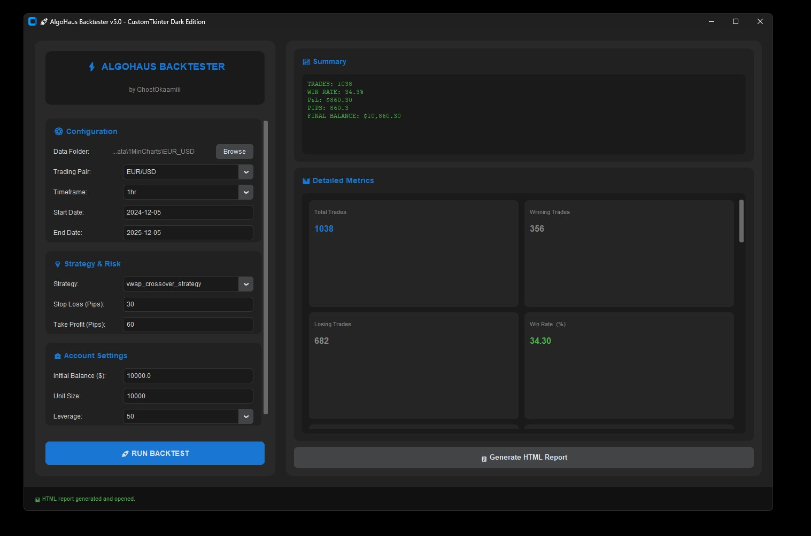

# 🚀 AlgoHaus Backtester v5.0

A professional-grade forex trading backtester with a modern dark-themed UI, advanced analytics, and comprehensive HTML reporting.


## ✨ Features

```


## Method 2: GitHub Issue/PR Image Upload Trick

1. Go to any GitHub issue or pull request (or create a new one)
2. Drag and drop your `prototype.jpg` into the comment box
3. GitHub will upload it and generate a URL like:
```

### 📊 Trading Strategies
- **Opening Range Breakout** - Trades based on the first 30-minute price range
- **VWAP Crossover** - Volume-weighted average price momentum strategy
- **Pivot Point Reversal** - Support/resistance bounce trading

### 📈 Advanced Analytics
- **QuantStats-style metrics** including Sharpe ratio, Sortino ratio, and maximum drawdown
- **Risk-adjusted performance** analysis with profit factor and win rate calculations
- **Temporal pattern analysis** to identify best trading hours and days
- **Monte Carlo simulations** for strategy robustness testing

### 🎨 Modern Dark UI
- Built with **CustomTkinter** for a sleek, professional appearance
- Real-time backtesting progress updates
- Collapsible trade logs and metric dashboards
- Responsive design with curved corners and smooth animations

### 📋 Professional HTML Reports
- Interactive **Plotly charts** with dark theme
- Equity curve vs price action comparison
- P&L distribution and drawdown analysis
- AI-powered performance insights and recommendations
- Strategy source code viewer with syntax highlighting

## 🚀 Quick Start

### Installation

```bash
# Clone the repository
git clone https://github.com/yourusername/algohaus-backtester.git
cd algohaus-backtester

# Install required packages
pip install customtkinter pandas numpy plotly
```

### Data Setup

1. Create a `data` folder in the project directory
2. Add your forex data in CSV format with columns: `datetime`, `open`, `high`, `low`, `close`, `volume`
3. Organize by pair: `data/EUR_USD/data.csv`

### Running the Backtester

```bash
python algohaus_backtester.py
```

## 📁 Project Structure

```
algohaus-backtester/
├── algohaus_backtester.py   # Main application
├── data/                     # Forex historical data
│   ├── EUR_USD/
│   ├── GBP_USD/
│   └── ...
└── README.md
```

## 🎯 Usage

1. **Select Data Folder** - Browse to your forex data directory
2. **Configure Settings**:
   - Choose trading pair and timeframe
   - Set date range for backtesting
   - Select trading strategy
   - Configure risk parameters (SL/TP in pips)
   - Set account parameters (balance, leverage, position size)
3. **Run Backtest** - Click "🚀 RUN BACKTEST" to start
4. **View Results** - Analyze metrics in the dashboard
5. **Generate Report** - Export comprehensive HTML report with charts

## 🔧 Configuration

### Supported Pairs
EUR/USD, GBP/USD, USD/JPY, USD/CHF, USD/CAD, AUD/USD, NZD/USD, EUR/JPY, GBP/JPY, and more...

### Timeframes
- 1min, 5min, 15min, 1hr, 1Day

### Leverage Options
- 1:1, 1:10, 1:20, 1:30, 1:50, 1:100, 1:200, 1:500

## 📊 Key Metrics

- **Performance**: Total return, annualized return, profit factor
- **Risk**: Maximum drawdown, Sharpe ratio, Sortino ratio
- **Trading**: Win rate, average win/loss, best/worst trades
- **Efficiency**: Average time in trade, risk-reward ratio

## 💡 Features Highlights

- **No Look-Ahead Bias**: Strategies use only historical data available at decision time
- **Realistic Execution**: Accounts for spreads, slippage, and margin requirements
- **Position Sizing**: Automatic calculation based on risk percentage
- **Multi-Currency Support**: Handles cross-currency pairs with conversion rates

## 🤝 Contributing

Contributions are welcome! Please feel free to submit a Pull Request.

## 📄 License

This project is licensed under the MIT License - see the LICENSE file for details.

## 🙏 Acknowledgments

- Built with [CustomTkinter](https://github.com/TomSchimansky/CustomTkinter) for the modern UI
- Charts powered by [Plotly](https://plotly.com/)
- Inspired by professional trading platforms and QuantStats analytics

## ⚠️ Disclaimer

This software is for educational purposes only. Past performance does not guarantee future results. Always practice proper risk management and test strategies thoroughly before live trading.

---

**Created by GhostOkaamiii** | [Report Issues](https://github.com/yourusername/algohaus-backtester/issues)